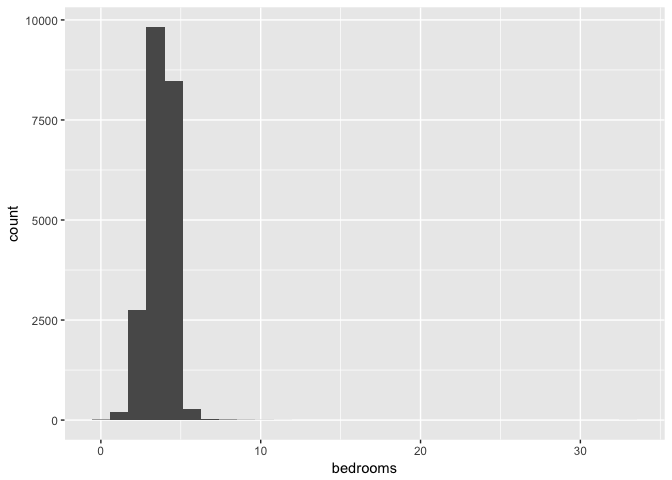
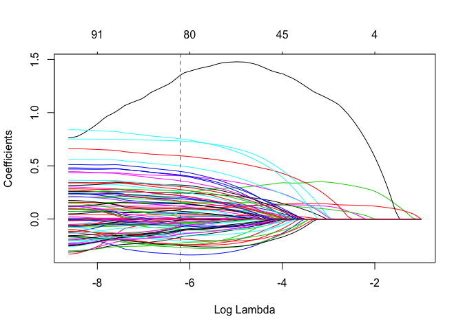

Ridge & Lasso Regression
================


This post is an implementation of two common regularization techniques namely  and  in R using a housing dataset.

When we try to fit a higher order polynomial in cases where there are a lot of independent variables we notice that our model tends to overfit (i.e have high variance). This is because, given a lot of dimensions it is not feasible to have training observations covering all different combinations of inputs. More importantly, it becomes much harder for OLS assumptions to hold ground as the no. of inputs increase. In such cases when can use regularization to control our regression coefficients and in turn reduce variance.

Ridge Regression
================

 is particularly useful in cases where we need to retain all inputs but reduce multicolinearity and noise caused by less influential variables.

Therefore, the objective in this case is predict the target variable considering all inputs.

Mathamatically, it can be defined as:


+\lambda||w||^2_2")

where,

Residual sum of squares = ")

Tuning parameter = 

L2 norm =  i.e 


The 2D contour plot below provies intution as to why the coefficients in ridge shrink to near zero but not exatly zero as we increase the tuning parameter().


In the above figure RSS equation has the form of an elipse (in red) and the L2 norm for 2 variables is naturally the equation of a circle (in blue). We can observe that their interaction is when  ~ 0 but not equal to 0.

``` r
#Libraries to be used
library(glmnet) #regularized regression package
library(ggplot2) #for plotting
library(caret) #hot one encoding
library(e1071) #skewess function
```


``` r
#Importing King county house sales dataset
getwd()
```

    ## [1] "/Users/apple/Google Drive/github/Ridge"

``` r
data = read.csv('kc_house_data.csv')
data = subset(data, select = -c(id, date))
data$floors = as.character(data$floors)
data$zipcode = as.character(data$zipcode)
str(data)
```

    ## 'data.frame':    21613 obs. of  19 variables:
    ##  $ price        : num  221900 538000 180000 604000 510000 ...
    ##  $ bedrooms     : int  3 3 2 4 3 4 3 3 3 3 ...
    ##  $ bathrooms    : num  1 2.25 1 3 2 4.5 2.25 1.5 1 2.5 ...
    ##  $ sqft_living  : int  1180 2570 770 1960 1680 5420 1715 1060 1780 1890 ...
    ##  $ sqft_lot     : int  5650 7242 10000 5000 8080 101930 6819 9711 7470 6560 ...
    ##  $ floors       : chr  "1" "2" "1" "1" ...
    ##  $ waterfront   : int  0 0 0 0 0 0 0 0 0 0 ...
    ##  $ view         : int  0 0 0 0 0 0 0 0 0 0 ...
    ##  $ condition    : int  3 3 3 5 3 3 3 3 3 3 ...
    ##  $ grade        : int  7 7 6 7 8 11 7 7 7 7 ...
    ##  $ sqft_above   : int  1180 2170 770 1050 1680 3890 1715 1060 1050 1890 ...
    ##  $ sqft_basement: int  0 400 0 910 0 1530 0 0 730 0 ...
    ##  $ yr_built     : int  1955 1951 1933 1965 1987 2001 1995 1963 1960 2003 ...
    ##  $ yr_renovated : int  0 1991 0 0 0 0 0 0 0 0 ...
    ##  $ zipcode      : chr  "98178" "98125" "98028" "98136" ...
    ##  $ lat          : num  47.5 47.7 47.7 47.5 47.6 ...
    ##  $ long         : num  -122 -122 -122 -122 -122 ...
    ##  $ sqft_living15: int  1340 1690 2720 1360 1800 4760 2238 1650 1780 2390 ...
    ##  $ sqft_lot15   : int  5650 7639 8062 5000 7503 101930 6819 9711 8113 7570 ...

``` r
dim(data)
```

    ## [1] 21613    19

``` r
sum(is.na(data)) #No missing data
```

    ## [1] 0

``` r
#Plotting histograms to see distribution of all numeric variables

#gather all non charecter features
feature_class = sapply(colnames(data),function(x){class(data[[x]])})
numeric_features = names(feature_class[feature_class != "character"])
numeric_features
```

    ##  [1] "price"         "bedrooms"      "bathrooms"     "sqft_living"  
    ##  [5] "sqft_lot"      "waterfront"    "view"          "condition"    
    ##  [9] "grade"         "sqft_above"    "sqft_basement" "yr_built"     
    ## [13] "yr_renovated"  "lat"           "long"          "sqft_living15"
    ## [17] "sqft_lot15"

``` r
#Plotting using ggplot
  for (i in numeric_features){
  print(ggplot(data = data, aes_string(x = i)) + geom_histogram(aes(x = data[i])) + theme_grey())
  }
```



We can observe that most of the variables are not normally distributed and highly skewed. To get rid of the skewness and to transform to normality we can apply a power transformation such as log.

``` r
#Removing skew for all numeric features using a power transformation (log) and hot one encoding categorical variables

# determine skew for each numeric feature
skewed_feats = sapply(numeric_features, function(x) {skewness(data[[x]])})
skewed_feats
```

    ##         price      bedrooms     bathrooms   sqft_living      sqft_lot 
    ##     4.0235106     1.9740255     0.5110366     1.4713512    13.0582062 
    ##    waterfront          view     condition         grade    sqft_above 
    ##    11.3835277     3.3952783     1.0326613     0.7709962     1.4464637 
    ## sqft_basement      yr_built  yr_renovated           lat          long 
    ##     1.5777460    -0.4697402     4.5488619    -0.4852031     0.8849301 
    ## sqft_living15    sqft_lot15 
    ##     1.1080275     9.5054237

``` r
#remove skew greater than 1
rem_skew = skewed_feats[skewed_feats>1]
rem_skew
```

    ##         price      bedrooms   sqft_living      sqft_lot    waterfront 
    ##      4.023511      1.974026      1.471351     13.058206     11.383528 
    ##          view     condition    sqft_above sqft_basement  yr_renovated 
    ##      3.395278      1.032661      1.446464      1.577746      4.548862 
    ## sqft_living15    sqft_lot15 
    ##      1.108027      9.505424

``` r
for (i in names(rem_skew)){
  data[[i]] = log(data[[i]]+1) # +1 as we have many 0 values in many columns
}
head(data)
```

    ##      price bedrooms bathrooms sqft_living  sqft_lot floors waterfront view
    ## 1 12.30999 1.386294      1.00    7.074117  8.639588      1          0    0
    ## 2 13.19562 1.386294      2.25    7.852050  8.887791      2          0    0
    ## 3 12.10072 1.098612      1.00    6.647688  9.210440      1          0    0
    ## 4 13.31133 1.609438      3.00    7.581210  8.517393      1          0    0
    ## 5 13.14217 1.386294      2.00    7.427144  8.997271      1          0    0
    ## 6 14.01845 1.609438      4.50    8.598036 11.532051      1          0    0
    ##   condition grade sqft_above sqft_basement yr_built yr_renovated zipcode
    ## 1  1.386294     7   7.074117      0.000000     1955     0.000000   98178
    ## 2  1.386294     7   7.682943      5.993961     1951     7.596894   98125
    ## 3  1.386294     6   6.647688      0.000000     1933     0.000000   98028
    ## 4  1.791759     7   6.957497      6.814543     1965     0.000000   98136
    ## 5  1.386294     8   7.427144      0.000000     1987     0.000000   98074
    ## 6  1.386294    11   8.266421      7.333676     2001     0.000000   98053
    ##       lat     long sqft_living15 sqft_lot15
    ## 1 47.5112 -122.257      7.201171   8.639588
    ## 2 47.7210 -122.319      7.433075   8.941153
    ## 3 47.7379 -122.233      7.908755   8.995041
    ## 4 47.5208 -122.393      7.215975   8.517393
    ## 5 47.6168 -122.045      7.496097   8.923191
    ## 6 47.6561 -122.005      8.468213  11.532051

``` r
#hot one encoding
categorical_feats = names(feature_class[feature_class == "character"])
categorical_feats
```

    ## [1] "floors"  "zipcode"

``` r
dummies = dummyVars(~., data[categorical_feats]) #from library caret
categorical_1_hot = predict(dummies, data[categorical_feats])
```

``` r
#Create master file and perform training-testing split

#Combining files
master_data = cbind(data[numeric_features], categorical_1_hot)

#Creating a training and testing split
l = round(0.7*nrow(master_data))
set.seed(7)
seq_rows = sample(seq_len(nrow(master_data)), size = l)
data_train = master_data[seq_rows,]
data_test = master_data[-seq_rows,]
```


Note:

1.  glmnet package trains our model for various values of 

2.  It provides a built-in option to perform k-fold CV.

3.  It standardizes predictor variables

4.  It doesn't accept the regular formula method (y ~ x) instead we need to supply an input matrix

(read the documentation for more info)

Flow:

1.  Train model and perform k-fold cross validation to pick the  value that minimizes MSE

2.  Use this  value to build a model on the entire training set

3.  Use the model from 2. to predict house prices on the test set

4.  Compare predictions with actual house prices and evaluate fit

``` r
#create matrices
data_train_x = as.matrix(data_train[,2:93])
data_train_y = as.matrix(data_train$price)
data_test_x = as.matrix(data_test[,2:93])
data_test_y = as.matrix(data_test$price)

#1. k-fold cv (k = 10 by default)
ridge_cv = cv.glmnet(
  x = data_train_x,
  y = data_train_y,
  alpha = 0 #0 for ridge
)
plot(ridge_cv)
```


From the plot we can observe that MSE increases once log() is greater than -2. The first dotted line is the  value with minimum MSE and the second dotted line is the  value at one standard error from minimum MSE.

``` r
min(ridge_cv$cvm) #lowest MSE
```

    ## [1] 0.03326178

``` r
ridge_cv$lambda.min #lambda for lowest MSE
```

    ## [1] 0.04042353

``` r
min = ridge_cv$lambda.1se #selecting the 1st se from lowest

#2. Final model
#visualization
ridge = glmnet(
  x = data_train_x,
  y = data_train_y,
  alpha = 0
)
plot(ridge, xvar = "lambda")
abline(v = log(ridge_cv$lambda.1se), col = "red", lty = "dashed") #lambda value we picked
```


In the above plot the red dotted line is the log() value that gives us the lowest MSE.

``` r
#building model using the seleceted lambda value
ridge_min = glmnet(
  x = data_train_x,
  y = data_train_y,
  alpha = 0, lambda = min
)
#Visualizing important variables

#function to return dataframe of coefficents without an intercept
coefficents = function(coefi, n){
  #coefi -> is the beta output of glmnet function
  #n -> is the desired number of features to be plotted
  #returns features coerced with values ordered in desc by abs value
  coef_v = as.matrix(coefi)
  as.data.frame(coef_v)
  colnames(coef_v)[1] = 'values'
  coef_f =  as.data.frame(dimnames(coef_v)[[1]])
  coef_final = cbind(coef_f,coef_v)
  colnames(coef_final)[1] = 'features'
  coef_final = coef_final[order(-abs(coef_final$values)),] 
  coef_final$values = round(coef_final$values, 2)
  coef_final = coef_final[1:n,]
  return(coef_final)
}

ggplot(coefficents(ridge_min$beta, 25), aes(x=features, y=values, label=values)) + 
  geom_point(stat='identity', fill="Black", size=6)  +
  geom_segment(aes(y = 0, 
                   x = features, 
                   yend = values, 
                   xend = features), 
               color = "Black") +
  geom_text(color="white", size=2) +
  labs(title="Top 25 influential variables", y = 'Coefficient Value') + 
  ylim(-1, 1) +
  coord_flip()
```


The above plot displays the top 25 influential variables and their coefficient values.

Now, we will use our model to predict house price and assess the quality of fit by computing the  value.

``` r
#predicting on test set
y_pred = predict(ridge_min, data_test_x)
#function to compute total sum of squares
r_sq = function(y, pred_y){
  #y -> Actual value of y in the test set
  #pred_y -> predicted y value
  tss = sum((y - mean(y))^2)
  rss = sum((pred_y - y)^2)
  return(reslut = 1 - (rss/tss))
}

r_sq(data_test_y, y_pred)
```

    ## [1] 0.8841862

Therefore, our model accounts for 88.4% of the variability in the training data.

As mentioned earlier,  is used in cases where we would like to retain all our features while reducing noise caused by less influential features. In case, we would like to make predictions by reduce the number of features in our model to a smaller subset then  is used.

Lasso Regression
================

Objective in this case is predict the target variable considering a subset of inputs (i.e seek a sparse solution).

Mathamatically, it can be defined as:


+\lambda||w||_1")

where,

Residual sum of squares = ")

Tuning parameter = 

L1 norm =  i.e 


The 2D contour plot below provies intution as to why the coefficients in lasso shrink to exactly zero instead of near zero like ridge.


In the above figure RSS equation has the form of an elipse (in red) and the L1 norm for 2 variables has the shape of a diamond (in blue). We can observe that their interaction is at  = 0. This provides intution as to why lasso solutions are sparse. Moreover, as we move to higher dimensions instead of a diamond L1 norm has the shape of a rhomboid which due to it's 'pointy' nature has a greater probability of contact with the RSS equation.

As before  plays the role of a tuning parameter but in this case, as it's increased, it pushes some of the insignificant features to zero.


As, we have performed the necessary preprocessing we can start the implementaton and our flow will be exatly like before:

1.  Train model and perform k-fold cross validation to pick the  value that minimizes MSE

2.  Use this  value to build a model on the entire training set

3.  Use the model from 2. to predict house prices on the test set

4.  Compare predictions with actual house prices and evaluate fit

``` r
#1. k-fold cv (k = 10 by default)
lasso_cv = cv.glmnet(
  x = data_train_x,
  y = data_train_y,
  alpha = 1 #1 for lasso
)
plot(lasso_cv)
```


As before, the first dotted line is the  value with minimum MSE and the second dotted line is the  value at one standard error from minimum MSE. Also notice how our features decrease the  value increases.

``` r
min(lasso_cv$cvm) #lowest MSE
```

    ## [1] 0.03282242

``` r
lasso_cv$lambda.min #lambda for lowest MSE
```

    ## [1] 0.0002157282

``` r
min_l = lasso_cv$lambda.1se #selecting the 1st se from lowest

#2. Final model
#visualization
lasso = glmnet(
  x = data_train_x,
  y = data_train_y,
  alpha = 1
)
plot(lasso, xvar = "lambda")
abline(v = log(lasso_cv$lambda.1se), col = "red", lty = "dashed") #lambda value we picked
```



Notice how the coefficient path is significantly different in ridge and lasso. We can observe that in ridge the coefficients mostly flock together but in this case they are all over the place. This is because, ridge distributes weights of the features to keep its  value low (and hence the cost function). A downside of this is that the individual impact of features will not be very clear.

``` r
#building model using the seleceted lambda value
lasso_min = glmnet(
  x = data_train_x,
  y = data_train_y,
  alpha = 1, lambda = min_l
)

#number of non zero coeff
length(lasso_min$beta[lasso_min$beta!=0])
```

    ## [1] 82

``` r
#Visualizing important variables
#let's utilize the function we created earlier as an input to the plot
# Diverging chart
ggplot(coefficents(lasso_min$beta, 82), aes(x=features, y=values, label=values)) + 
  geom_point(stat='identity', fill="Black", size=6)  +
  geom_segment(aes(y = 0, 
                   x = features, 
                   yend = round(values,2), 
                   xend = features), 
               color = "Black") +
  geom_text(color="white", size=2) +
  labs(title="Top influential variables", y = 'Coefficient Value') + 
  ylim(-1, 1) +
  coord_flip()
```


The obove plot shows all the remaining influential variables and their coefficient value.

Now, predicting results and model assesment.

``` r
#predicting lasso on test set
y_pred_l = predict(lasso_min, data_test_x)
#computing r_squared
r_sq(data_test_y, y_pred_l)
```

    ## [1] 0.8858732

Our model holds slightly better than ridge accounting for 88.5% of the variability. However, notice that this prediction was with 82 features instead of 92 like in ridge.
